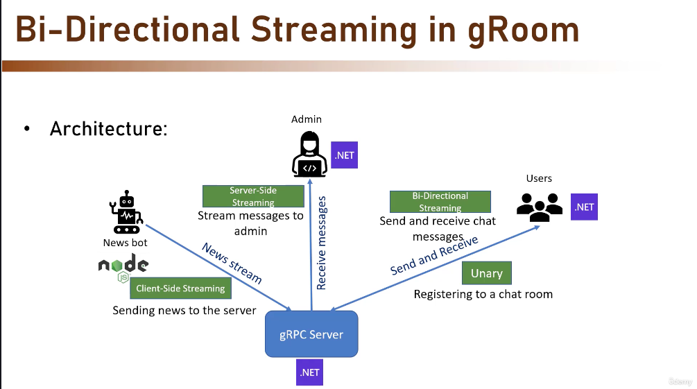

# gRPC Learning and Demonstration Projects

A comprehensive collection of gRPC projects showcasing Protocol Buffers, unary RPC, server streaming, client streaming, bidirectional streaming, and multi-language interoperability (.NET and JavaScript).

## 📋 Project Overview

| Project | Type | Language | Purpose |
|---------|------|----------|---------|
| **example** | Console App | C# | Protobuf serialization/deserialization demo |
| **groomserver** | gRPC Server | C# / ASP.NET Core | Central message hub and room management |
| **groomclient** | Console App | C# | Room registration client (unary RPC) |
| **groomadmin** | Console App | C# | Message monitoring client (server streaming) |
| **newsbot** | Console App | Node.js | News broadcasting client (client streaming) |

## 📡 RPC Communication Patterns

### Overview of RPC Types in This Project

| RPC Type | Pattern | Used By | Example |
|----------|---------|---------|---------|
| **Unary** | Client sends request → Server sends single response | groomclient | User registers to a room |
| **Server Streaming** | Client sends request → Server streams multiple responses | groomadmin | Server sends continuous message stream |
| **Client Streaming** | Client streams multiple requests → Server sends response | newsbot | Send multiple news items, get confirmation |
| **Bidirectional Streaming** | Both client & server stream simultaneously | Future extension | Real-time chat between client and server |

### 🔄 Bidirectional Communication Explained

**Bidirectional streaming** (also called "full-duplex") is the most powerful RPC pattern where both client and server can send and receive messages independently at the same time, in any order.

#### Use Cases
- **Real-time chat applications** - Messages flow both ways simultaneously
- **Live video/audio calls** - Audio streams from both client and server
- **Collaborative tools** - Both parties send updates in real-time
- **Interactive games** - Player actions and game state updates flow continuously both ways
- **Live notifications** - Server pushes updates while client sends acknowledgments

#### How It Differs From Other Patterns

```
Unary RPC:
Client: ────→ Request  Server
        ←────  Response

Server Streaming:
Client: ────→ Request  Server
        ←──── Message1
        ←──── Message2
        ←──── Message3

Client Streaming:
Client: ────→ Message1
        ────→ Message2
        ────→ Message3  Server
        ←──── Response

Bidirectional Streaming:
Client ⟷⟷⟷⟷⟷⟷⟷⟷⟷⟷ Server
(Messages flow both ways simultaneously)
```

#### Example Implementation (Pseudo-code)

If we extended this project with bidirectional chat, it would look like:

```protobuf
// groom_chat.proto
service GroomChat {
  rpc ChatStream(stream ChatMessage) returns (stream ChatMessage);
}

message ChatMessage {
  string user = 1;
  string content = 2;
  int64 timestamp = 3;
  string room = 4;
}
```

C# Server Implementation:
```csharp
public override async Task ChatStream(
    IAsyncStreamReader<ChatMessage> requestStream,
    IAsyncStreamWriter<ChatMessage> responseStream,
    ServerCallContext context)
{
    // Read incoming messages from client
    while (await requestStream.MoveNext(context.CancellationToken))
    {
        var message = requestStream.Current;
        // Process message
        
        // Simultaneously send messages to client
        await responseStream.WriteAsync(new ChatMessage 
        { 
            User = "Server", 
            Content = "Echo: " + message.Content 
        });
    }
}
```

C# Client:
```csharp
using var call = client.ChatStream();

// Send messages to server
var sendTask = Task.Run(async () =>
{
    for (int i = 0; i < 5; i++)
    {
        await call.RequestStream.WriteAsync(
            new ChatMessage { User = "Client", Content = "Hello " + i });
        await Task.Delay(1000);
    }
    await call.RequestStream.CompleteAsync();
});

// Simultaneously receive messages from server
await foreach (var response in call.ResponseStream.ReadAllAsync())
{
    Console.WriteLine($"{response.User}: {response.Content}");
}
```

#### Key Characteristics
- **Asynchronous:** Both sides operate independently, no waiting for responses
- **Full-duplex:** Data flows in both directions simultaneously
- **Ordered:** Messages are processed in the order they arrive
- **Buffered:** Messages are queued if one side can't process immediately
- **Connection-oriented:** Uses a single persistent connection for entire conversation

#### Advantages
✅ Real-time two-way communication  
✅ Single persistent connection (efficient)  
✅ No polling needed  
✅ Natural for conversational applications  
✅ Better latency than request-response patterns  

#### Challenges
⚠️ More complex error handling  
⚠️ Connection lifecycle management  
⚠️ Harder to debug (asynchronous)  
⚠️ Requires careful resource management  


## 🏗️ Architecture

```
┌─────────────────┐  ┌──────────────┐  ┌──────────────┐  ┌─────────────┐
│  groomclient    │  │  groomadmin  │  │   newsbot    │  │   example   │
│  (C# Unary RPC) │  │(C# Streaming)│  │ (JS Streaming)  │ (Protobuf)  │
└────────┬────────┘  └──────┬───────┘  └──────┬───────┘  └─────────────┘
         │                  │                  │
         │ RegisterToRoom   │ StartMonitoring  │ SendNewsFlash
         │                  │                  │
         └──────────────────┴──────────────────┘
                            │
                            ▼
                    ┌──────────────────┐
                    │  groomserver     │
                    │  (gRPC Server)   │
                    │  Port: 5071      │
                    │                  │
                    │ • Room Mgmt      │
                    │ • Message Queue  │
                    │ • Broadcasting   │
                    └──────────────────┘
```

## 🚀 Quick Start

### Prerequisites
- .NET 10.0 SDK
- Node.js 18+ (for newsbot)
- Visual Studio or VS Code

### Setup

1. **Clone/Open the solution:**
   ```bash
   cd /Users/hmarques/workspace/csharp/grpc
   ```

2. **Build the solution:**
   ```bash
   dotnet build grpc.sln
   ```

3. **Install newsbot dependencies:**
   ```bash
   cd newsbot
   npm install
   ```

### Running the Projects

#### 1. Start the gRPC Server
```bash
cd groomserver
dotnet run
# Server will be available at localhost:5071
```

#### 2. Register a Room (in a new terminal)
```bash
cd groomclient
dotnet run
# Enter a room name when prompted
```

#### 3. Monitor Messages (in another terminal)
```bash
cd groomadmin
dotnet run
# Will stream all messages from the server
```

#### 4. Send News (in another terminal)
```bash
cd newsbot
npm install
node client.js
# Sends 10 random news items to the server
```

#### 5. Run Protobuf Demo
```bash
cd example
dotnet run
# Demonstrates Protocol Buffer serialization
```

## 📖 Project Details

### example - Protocol Buffers Demo
- **Purpose:** Learn Protocol Buffers serialization and deserialization
- **Features:**
  - Creates an Employee object with complex fields
  - Serializes to binary format using `employee.proto`
  - Deserializes and displays the data
  - Demonstrates Protobuf features: `oneof`, enums, maps, repeated fields
- **Proto Definition:** `employee.proto`

### groomserver - gRPC Server
- **Purpose:** Central message hub with room management and message broadcasting
- **Endpoints:**
  - `RegisterToRoom` (Unary RPC) - Register a client to a specific room
  - `SendNewsFlash` (Client Streaming) - Accept stream of news items from clients
  - `StartMonitoring` (Server Streaming) - Stream messages to monitoring clients
- **Features:**
  - Internal message queue for message management
  - Multi-room support
  - Real-time message broadcasting
- **Proto Definition:** `groom.proto`
- **Port:** 5071

### groomclient - Room Registration Client
- **Purpose:** Demonstrate unary RPC communication
- **Features:**
  - Connect to groomserver
  - Register user to a room
  - Simple interactive CLI
- **Proto Definition:** `groom.proto`
- **Technology:** C# / Grpc.Net.Client

### groomadmin - Message Monitoring Client
- **Purpose:** Demonstrate server streaming RPC
- **Features:**
  - Connect to groomserver
  - Receive real-time message stream
  - Monitor all messages in the system
  - Display message details (content, user, timestamp)
- **Proto Definition:** `groom.proto`
- **Technology:** C# / Grpc.Net.Client

### newsbot - News Broadcasting Client
- **Purpose:** Demonstrate client streaming RPC and multi-language gRPC interoperability
- **Features:**
  - Connect to groomserver from Node.js
  - Send stream of news items at 1-second intervals
  - Multiple predefined news categories (stocks, weather, events, etc.)
  - Shows .NET server ↔ JavaScript client communication
- **Proto Definition:** `groom.proto`
- **Technology:** Node.js / @grpc/grpc-js
- **Main File:** `client.js`

## 🔧 Key Technologies

- **gRPC** - High-performance RPC framework
- **Protocol Buffers (Proto3)** - Efficient data serialization
- **.NET 10.0** - Modern C# runtime
- **ASP.NET Core** - Web framework for gRPC server
- **Node.js** - JavaScript runtime for cross-language demo
- **Visual Studio Solution** - `grpc.sln` for integrated development

## 📚 Learning Path

1. **Start with `example`** - Understand Protocol Buffers basics
2. **Run `groomserver`** - Start the server
3. **Try `groomclient`** - Learn unary RPC
4. **Run `groomadmin`** - Explore server streaming
5. **Run `newsbot`** - Experience client streaming and cross-language communication

## 🔗 Proto Definitions

### groom.proto
Located in each project, defines:
- `Room` message
- `Item` message
- `Message` message (with user, content, timestamp)
- `Groom` service with three RPC methods

### employee.proto
Used by `example` project, defines:
- `Employee` message with complex fields
- `Address` message
- Enum types and maps

## 📝 License

This project is for learning purposes.

## 🔧 Troubleshooting

### Common Issues

#### **Server Won't Start**
- **Error:** `Address already in use` or `Port 5071 is busy`
  - **Solution:** Kill the existing process on port 5071 or change the port in `groomserver/Program.cs`
  ```bash
  # macOS/Linux
  lsof -i :5071
  kill -9 <PID>
  
  # Windows
  netstat -ano | findstr :5071
  taskkill /PID <PID> /F
  ```

#### **Clients Can't Connect to Server**
- **Error:** `UNAVAILABLE: failed to connect to all addresses` or `Connection refused`
  - **Solution:** 
    1. Ensure groomserver is running and listening on `localhost:5071`
    2. Check firewall settings
    3. Verify correct address in client connection code (should be `localhost:5071`)
    4. Try `dotnet run` without release mode first for debugging

#### **Proto Files Not Found**
- **Error:** `Proto file not found` in newsbot
  - **Solution:**
    1. Ensure you're in the correct directory: `cd newsbot`
    2. Copy `groom.proto` from another project to the newsbot directory if missing
    3. Verify the path in `client.js` matches your file location

#### **newsbot: npm Dependencies Missing**
- **Error:** `Cannot find module '@grpc/grpc-js'`
  - **Solution:**
    ```bash
    cd newsbot
    npm install
    npm install --save @grpc/grpc-js @grpc/proto-loader
    ```

#### **Build Failures**
- **Error:** Project fails to build with `dotnet build`
  - **Solution:**
    1. Clean the build: `dotnet clean grpc.sln`
    2. Restore packages: `dotnet restore grpc.sln`
    3. Rebuild: `dotnet build grpc.sln`

#### **Proto Compilation Issues in C#**
- **Error:** `Failed to generate C# files from proto`
  - **Solution:**
    1. Ensure Grpc.Tools is installed: `dotnet list package --outdated`
    2. Regenerate proto files: `dotnet build /p:RegenerateProtos=true`
    3. Check `.csproj` file for correct `<Protobuf>` item references

#### **Node.js Port Conflicts**
- **Error:** newsbot connects but no data flows
  - **Solution:**
    1. Ensure groomserver is running first
    2. Check server is actually listening: `curl -i -N -H "Connection: Upgrade" http://localhost:5071`
    3. Verify Node.js gRPC version matches server expectations
    4. Try running with verbose logging: `DEBUG=* node client.js`

### Debug Tips

- **Check server logs:** Run groomserver with detailed output to see incoming connections
- **Monitor messages:** Keep groomadmin running to see all system messages in real-time
- **Test connectivity:** Use `netstat` or `lsof` to verify ports are open
- **Enable detailed errors:** Set environment variable: `export GRPC_VERBOSITY=DEBUG` before running clients

## 🤝 Contributing

Feel free to extend these projects with new features, additional clients, or new RPC patterns (bidirectional streaming, etc.).

## Bi-directional streaming in gRoom
